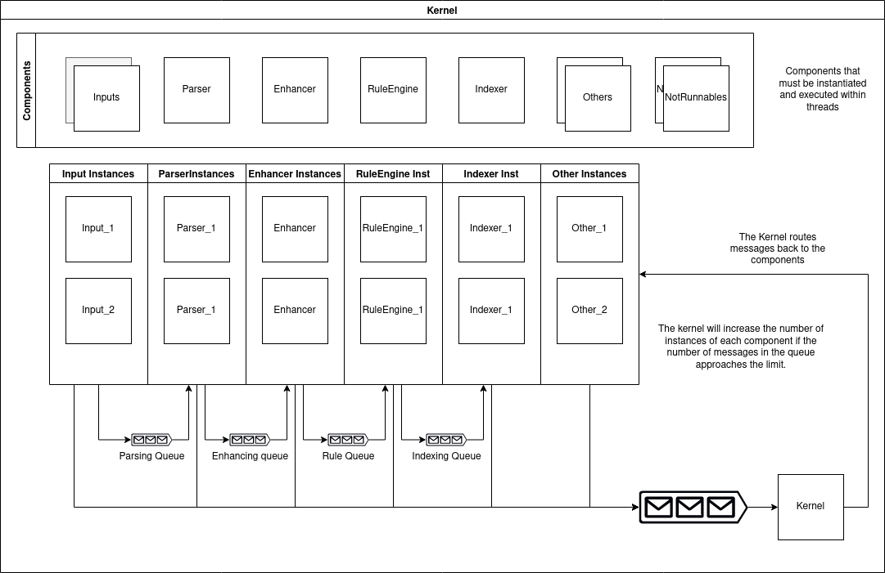

# µSIEM Kernel

[](https://docs.rs/u-siem) 

A basic kernel to be used in uSIEM

The kernel is responsible for interconnecting the components, scaling the components to absorb the load, and routing messages and commands between them. 


## Metrics

This kernels allows the usage of prometheus metrics:

```rust
let encoder = prometheus::TextEncoder::new();
let mut buffer = Vec::new();
if let Err(e) = encoder.encode(&(usiem_kernel::REGISTRY).gather(), &mut buffer) {
    eprintln!("could not encode custom metrics: {}", e);
};
```

## InnerWorkings



The kernel has a list of components already configured that it will use to instantiate and run in new threads.

```rust
let component1 : SiemComponent = InputComponent1::new(param1,param2);
let component2 : SiemComponent = ParserComponent1::new(param1,param2);
let mut kernel = SiemBasicKernel::new(1000, 4, 5000);
kernel.register_input_component(component1);
kernel.register_parser_component(component2);
...
kernel.run()
```

Input components will receive logs (syslog, elastic like, from file...) and add them to the parsing queue.
Parsing components will process the logs adding fields and the log type in the form of a `SiemEvent` (Firewall, DHCP, DNS...).
enricher components will extract usefull information to enrich other types of logs or in rules. This information will be stored in Datasets that are dynamically populated. 

The datasets are shared across all threads without the need for a Mutex. This is achived using `crossbeam_channels`, the component will receive on its local channel updates of the datasets it needs directly from the DatasetManager component, and it will also be able to submit Updates using the channel of this DatasetManager.

The component will receive a `SiemDataset` enum that has a fixed number of types. Inside we will find a `SyncDataset` that contains a reference shared across all threads using an `Arc` and a channel to send Updates to the DatasetManager:

```rust
#[derive(Serialize, Debug)]
pub enum UpdateTextSet {
    Add(Cow<'static, str>),
    Remove(Cow<'static, str>),
    Replace(TextSetDataset),
}
#[derive(Debug, Clone)]
pub struct TextSetSynDataset {
    dataset: Arc<TextSetDataset>,
    comm: Sender<UpdateTextSet>,
}
#[derive(Serialize, Debug)]
pub struct TextSetDataset {
    data: BTreeSet<Cow<'static, str>>
}
#[derive(Debug, Clone)]
#[non_exhaustive]
pub enum SiemDataset {
    /// Map IP to country, city, latitude and longitude
    GeoIp(GeoIpSynDataset),
    /// IP associated with a hostname
    IpHost(IpMapSynDataset),
    /// IP associated with a MAC address
    IpMac(IpMapSynDataset),
    /// IP associated with a resolved domain
    IpDNS(IpMapListSynDataset),
    /// MAC address associated with a Hostname
    MacHost(TextMapSynDataset),
    /// Hostname associated with a username
    HostUser(TextMapSynDataset),
    /// List of IPs in the block list
...
```

The usage of a channel and not a mutex allows for a higher number of reads and to be usable in a cluster (but only if the Kernel and the DatasetManager are designed to). The writes per second are also higher than a Mutex because we can commit multiple updates at the same time as to not instantiate a new Dataset with each update. 